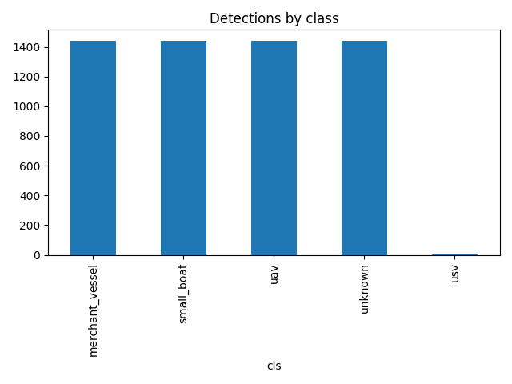
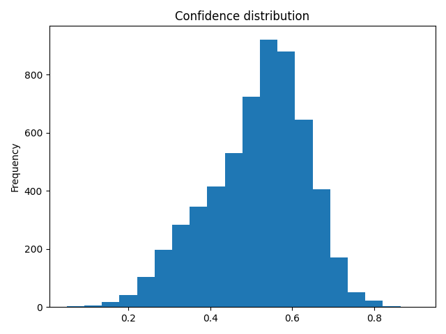

# ISR to Strike Replay - Summary Brief

**Time window:** 2026-04-01 06:00:00+00:00 to 2026-04-01 18:00:00+00:00

## Key numbers
- Total events: 5769
- Detections (conf>=0.5): 3492
- Relevant (model): 646
- Engagement recommended: 34

## Rationale
Engagement is recommended when an event is predicted relevant (prob>=0.5), confidence>=0.75, and priority<=2.

## Quick view of first recommended engagements
- 2026-04-01 06:33:00+00:00 | uav | conf=0.80 | prio=2 | prob=1.00
- 2026-04-01 06:53:30+00:00 | uav | conf=0.76 | prio=2 | prob=1.00
- 2026-04-01 06:57:00+00:00 | merchant_vessel | conf=0.75 | prio=2 | prob=1.00
- 2026-04-01 07:27:00+00:00 | uav | conf=0.76 | prio=2 | prob=1.00
- 2026-04-01 07:28:00+00:00 | uav | conf=0.77 | prio=2 | prob=1.00
- 2026-04-01 07:36:30+00:00 | merchant_vessel | conf=0.78 | prio=2 | prob=1.00
- 2026-04-01 08:09:30+00:00 | merchant_vessel | conf=0.79 | prio=2 | prob=1.00
- 2026-04-01 08:33:30+00:00 | merchant_vessel | conf=0.80 | prio=2 | prob=1.00
- 2026-04-01 08:34:00+00:00 | merchant_vessel | conf=0.80 | prio=2 | prob=1.00
- 2026-04-01 09:58:00+00:00 | merchant_vessel | conf=0.77 | prio=2 | prob=1.00

## Figures

## Notes
- Relevance is learned from a synthetic heuristic; replace with domain rules or labeled data.
- CSV `data/kepler_events.csv` is ready for Kepler.gl (lat, lon, timestamp).
